# Current Water Balance Model Diagram

Generated from the active Django water-balance configuration on 2026-07-19.

This diagram shows how the configured model attributes production sources and meters to zone supply. It is for Technical and Distribution review before operational rollout. The water-balance module explains source attribution; it does not change official meter readings.

## Visual Flow

```mermaid
flowchart LR
  classDef site fill:#e8f4ff,stroke:#2563eb,color:#0f172a
  classDef meter fill:#fff7ed,stroke:#f97316,color:#0f172a
  classDef node fill:#ecfdf5,stroke:#16a34a,color:#0f172a
  classDef zone fill:#f8fafc,stroke:#475569,color:#0f172a
  classDef review fill:#fef2f2,stroke:#dc2626,color:#0f172a

  subgraph production_sites["Production Sites / Sources"]
    DTI["DTI"]
    AIC["A.I.C"]
    PL["POLICELINE"]
    KARATI["KARATI"]
    WWS["WATERWORKS"]
    DCK["DCK"]
    NIP["NIP"]
    MAI["MAI MAHIU"]
    KINUNGI["KINUNGI"]
    NGONDI["NGONDI"]
    NYONJORO["NYONJORO"]
    IHINDU1["IHINDU 1"]
    IHINDU2["IHINDU 2"]
  end

  subgraph meters["Configured Meter References"]
    DTI_INLET["DTI Inlet Meter<br/>DTI-INLET-METER"]
    DTI_KABATI["DTI Kabati Meter<br/>KABATI-KAG-METER"]
    DTI_MAKABURI["DTI Makaburi Meter<br/>KABATI-MAKABURI-METER"]
    DTI_UPPER_SITE["DTI Upper Site Meter<br/>UPPER-SITE-METER"]
    DTI_CONSOLATA["DTI Consolata Meter<br/>CONSOLATA-METER"]
    AIC_SUPPLY["AIC Supply Meter<br/>AIC-SUPPLY-METER"]
    PL_BH["Police Line BH Meter<br/>POLICE-LINE-BH-METER"]
    KARATI_HOPEWELL["Karati Hopewell Meter<br/>KARATI-HOPEWELL-METER"]
    UPPER_KWS_KAYOLE["Upper KWS Kayole Meter<br/>UPPER-KWS-KAYOLE-METER"]
    DCK_BH1["DCK BH1 Meter<br/>DCK-BH1-METER"]
    KIJABE["Kijabe Offtake Meter<br/>KIJABE-OFFTAKE-METER"]
    LONGONOT_MAIN["Longonot Main Meter<br/>LONGONOT-MAIN-METER"]
    MMBH1["Maai Mahiu BH1 Meter<br/>MAAI-MAHIU-BH1-METER"]
    MMBH2["Maai Mahiu BH2 Meter<br/>MAAI-MAHIU-BH2-METER"]
    NGUJIRI["Ngujiri Meter<br/>NIP-GATHIMA-NGUJIRI-METER"]
    KARIMA["Karima NIP 1 Meter<br/>KARIMA-NIP-1"]
    NAROK["Narok Water Meter<br/>NAROK-METER"]
    DRYPORT["ICD Dryport Meter<br/>ICD-DRYPORT-METER"]
    KINUNGI_BH1["Kinungi Borehole 1 Production Meter<br/>KINUNGI-BH1-METER"]
    NGONDI_BH1["Ngondi Meter<br/>NGONDI-BH1-METER"]
    NYONJORO_BH1["Nyonjoro Meter<br/>NYONJORO-BH1-METER"]
    IHINDU1_BH1["Ihindu 1 Production Meter<br/>IHINDU-1-BH1-METER"]
    IHINDU2_BH1["Ihindu 2 Production Meter<br/>IHINDU-2-BH1-METER"]
  end

  subgraph balance_nodes["Configured Balance Nodes"]
    CBD_TANK["CBD Common Distribution Tank<br/>MIXING_NODE"]
    WWS_POOL["Water Works Pool<br/>MIXING_NODE"]
    UPPER_KWS["Upper KWS<br/>INTERMEDIARY<br/>No active inputs/rules found"]
  end

  subgraph central_zones["Central Zones"]
    CBD["CBD"]
    CCCR["CCCR"]
    KABATI["Kabati"]
    SITE_SERVICES["Site and Services"]
    HOPEWELL["Hopewell"]
    KIHOTO["Kihoto"]
    CONSOLATA["Consolata"]
  end

  subgraph southern_zones["Southern Zones"]
    KAMERE["Kamere"]
    HELLS_GATE["Hells Gate"]
    MAI_MAHIU_ZONE["Mai-Mahiu"]
    LONGONOT["Longonot"]
  end

  subgraph eastern_zones["Eastern Zones"]
    LAKEVIEW["Lakeview"]
    KAYOLE["Kayole"]
    KINUNGI_ZONE["Kinungi"]
    GONDI["Gondi"]
    NYONJORO_ZONE["Nyonjoro"]
    IHINDU["Ihindu"]
  end

  DTI --> DTI_INLET --> CBD_TANK
  AIC --> AIC_SUPPLY --> CBD_TANK
  PL --> PL_BH --> CBD_TANK

  CBD_TANK -->|"Mixing-node source ratio"| CBD
  CBD_TANK -->|"Mixing-node source ratio"| CCCR
  CBD_TANK -->|"Mixing-node source ratio"| KIHOTO

  DTI --> DTI_KABATI -->|"Metered volume"| KABATI
  DTI --> DTI_MAKABURI -->|"Metered volume; summed with Kabati meter"| KABATI
  DTI --> DTI_UPPER_SITE -->|"Metered volume"| SITE_SERVICES
  DTI --> DTI_CONSOLATA -->|"Metered volume"| CONSOLATA

  KARATI --> KARATI_HOPEWELL --> HOPEWELL

  WWS -->|"Site production from DailyProduction.water_abstracted_m3"| WWS_POOL
  KARATI -->|"Residual input into Water Works Pool"| WWS_POOL
  WWS_POOL -->|"Mixing-node share"| LAKEVIEW
  WWS_POOL -->|"Mixing-node share"| KAYOLE
  KARATI --> UPPER_KWS_KAYOLE --> KAYOLE

  DCK --> DCK_BH1 --> KAMERE
  NIP --> KIJABE --> HELLS_GATE
  NIP --> LONGONOT_MAIN --> LONGONOT

  MAI --> MMBH1 --> MAI_MAHIU_ZONE
  MAI --> MMBH2 --> MAI_MAHIU_ZONE
  NIP --> NGUJIRI --> MAI_MAHIU_ZONE
  NIP --> KARIMA --> MAI_MAHIU_ZONE
  NIP --> NAROK --> MAI_MAHIU_ZONE
  NIP --> DRYPORT --> MAI_MAHIU_ZONE

  KINUNGI --> KINUNGI_BH1 --> KINUNGI_ZONE
  NGONDI --> NGONDI_BH1 --> GONDI
  NYONJORO --> NYONJORO_BH1 --> NYONJORO_ZONE
  IHINDU1 --> IHINDU1_BH1 --> IHINDU
  IHINDU2 --> IHINDU2_BH1 --> IHINDU

  UPPER_KWS:::review

  class DTI,AIC,PL,KARATI,WWS,DCK,NIP,MAI,KINUNGI,NGONDI,NYONJORO,IHINDU1,IHINDU2 site
  class DTI_INLET,DTI_KABATI,DTI_MAKABURI,DTI_UPPER_SITE,DTI_CONSOLATA,AIC_SUPPLY,PL_BH,KARATI_HOPEWELL,UPPER_KWS_KAYOLE,DCK_BH1,KIJABE,LONGONOT_MAIN,MMBH1,MMBH2,NGUJIRI,KARIMA,NAROK,DRYPORT,KINUNGI_BH1,NGONDI_BH1,NYONJORO_BH1,IHINDU1_BH1,IHINDU2_BH1 meter
  class CBD_TANK,WWS_POOL node
  class CBD,CCCR,KABATI,SITE_SERVICES,HOPEWELL,KIHOTO,CONSOLATA,KAMERE,HELLS_GATE,MAI_MAHIU_ZONE,LONGONOT,LAKEVIEW,KAYOLE,KINUNGI_ZONE,GONDI,NYONJORO_ZONE,IHINDU zone
```

## Active Configuration Summary

- Active zone balance models: 17
- Active balance rules: 32
- Active balance nodes: 3
- Active node inputs: 5
- Active legacy production-zone allocation rules: 0

## Balance Nodes

| Node | Type | Active Inputs | Current Use |
|---|---|---:|---|
| CBD Common Distribution Tank | Mixing node | 3 | Supplies CBD, CCCR, and Kihoto by input source ratios. |
| Water Works Pool | Mixing node | 2 | Supplies Lakeview and part of Kayole by Water Works/Karati ratios. |
| Upper KWS | Intermediary | 0 | Active node exists, but no active inputs or rules currently use it. |

## Node Inputs

| Node | Production Site | Input Method | Meter / Basis | Confidence |
|---|---|---|---|---|
| CBD Common Distribution Tank | DTI | Metered transfer | DTI Inlet Meter | Measured |
| CBD Common Distribution Tank | A.I.C | Metered transfer | AIC Supply Meter | Measured |
| CBD Common Distribution Tank | POLICELINE | Metered transfer | Police Line BH Meter | Measured |
| Water Works Pool | WATERWORKS | Site production | DailyProduction.water_abstracted_m3 | Measured |
| Water Works Pool | KARATI | Residual | Water Works node output minus own production | Estimated |

## Zone Attribution Rules

| Region | Zone | Production Site(s) | Rule Method | Meter / Node / Basis |
|---|---|---|---|---|
| Central | CBD | DTI, A.I.C, POLICELINE | Mixing-node share | CBD Common Distribution Tank |
| Central | CCCR | DTI, A.I.C, POLICELINE | Mixing-node share | CBD Common Distribution Tank |
| Central | Kihoto | DTI, A.I.C, POLICELINE | Mixing-node share | CBD Common Distribution Tank |
| Central | Kabati | DTI | Metered volume | DTI Kabati Meter + DTI Makaburi Meter |
| Central | Site and Services | DTI | Metered volume | DTI Upper Site Meter |
| Central | Consolata | DTI | Metered volume | DTI Consolata Meter |
| Central | Hopewell | KARATI | Metered volume | Karati Hopewell Meter |
| Southern | Kamere | DCK | Metered volume | DCK BH1 Meter |
| Southern | Hells Gate | NIP | Metered volume | Kijabe Offtake Meter |
| Southern | Longonot | NIP | Metered volume | Longonot Main Meter |
| Southern | Mai-Mahiu | MAI MAHIU, NIP | Metered volume | Maai Mahiu BH1, Maai Mahiu BH2, Ngujiri, Karima NIP 1, Narok Water, ICD Dryport |
| Eastern | Lakeview | WATERWORKS, KARATI | Mixing-node share | Water Works Pool |
| Eastern | Kayole | KARATI, WATERWORKS | Metered volume plus mixing-node share | Upper KWS Kayole Meter plus Water Works Pool |
| Eastern | Kinungi | KINUNGI | Metered volume | Kinungi Borehole 1 Production Meter |
| Eastern | Gondi | NGONDI | Metered volume | Ngondi Meter |
| Eastern | Nyonjoro | NYONJORO | Metered volume | Nyonjoro Meter |
| Eastern | Ihindu | IHINDU 1, IHINDU 2 | Metered volume | Ihindu 1 Production Meter plus Ihindu 2 Production Meter |

## Review Questions For Technical And Distribution Teams

1. Confirm whether CBD, CCCR, and Kihoto should all use the same CBD Common Distribution Tank source ratios.
2. Confirm that Kabati supply from DTI should remain the sum of the DTI Kabati and DTI Makaburi meters.
3. Confirm that Site and Services supply from DTI should use the DTI Upper Site meter only.
4. Confirm that Consolata supply from DTI should use the DTI Consolata meter only.
5. Confirm whether Hopewell should be attributed only to Karati through the Karati Hopewell Meter.
6. Confirm whether Lakeview and Kayole should use Water Works Pool ratios, especially the estimated Karati residual input.
7. Confirm whether Kayole should combine Upper KWS Kayole Meter with Water Works Pool attribution as currently configured.
8. Confirm whether the active Upper KWS intermediary node should remain standalone, or whether it should have node inputs/rules.
9. Confirm Mai-Mahiu meter coverage: Maai Mahiu BH1, Maai Mahiu BH2, Ngujiri, Karima NIP 1, Narok Water, and ICD Dryport.
10. Confirm production-site naming differences before rollout, especially NGONDI versus Gondi and POLICELINE versus Police Line.
11. Confirm whether all direct production-equals-supply zones need any loss/transfer adjustment before reporting.
12. Confirm that the effective start date of 2026-01-01 is acceptable for all active models.

## Interpretation Notes

- `METERED_VOLUME` means the configured meter reading directly contributes to the zone attribution.
- `MIXING_NODE_SHARE` means the zone is attributed using the calculated ratio of active node inputs.
- `FIXED_PERCENTAGE` means the zone's measured supply is attributed by percentage.
- `RESIDUAL` means the system estimates the remaining source contribution after measured inputs are accounted for.
- Any proposed change should be made in the water-balance configuration before live rollout so historical review and dashboard output remain explainable.
